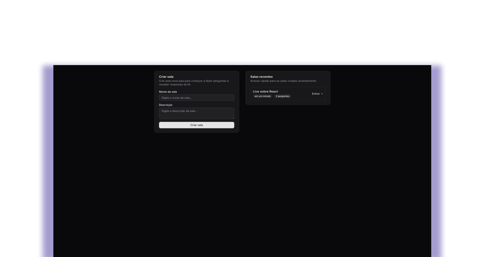

# NLW Agents - Frontend

Aplicação web desenvolvida durante um evento da [Rocketseat](https://www.rocketseat.com.br/), com foco em demonstrar o uso de agentes inteligentes na interface, consumindo uma API com IA para transcrição e resposta contextual em tempo real.

## Índice

- [Páginas](#paginas)
- [Tecnologias](#tecnologias)
- [Padrões de Projeto](#padroes)
- [Setup e Configuração](#setupeconfiguracao)
- [Estrutura do Projeto](#estrutura)

## Páginas

### Inicial

Página inicial com lista de salas e criação de novas salas.

 

### Sala

Página da sala com formulário para perguntas, lista de perguntas e respostas.

 

### Gravações

Página de gravações de áudio, onde o usuário pode iniciar e parar a gravação.

 

## Tecnologias

- **React 19.1** - Biblioteca para interfaces de usuário
- **TypeScript 5.8** - Superset JavaScript com tipagem estática
- **Vite 7.0** - Build tool e servidor de desenvolvimento
- **TailwindCSS 4.1** - Framework CSS utility-first
- **React Router Dom 7.6** - Biblioteca de roteamento
- **TanStack React Query 5.8** - Gerenciamento de estado servidor e cache
- **Radix UI** - Componentes primitivos acessíveis
- **Shadcn/ui** - Sistema de componentes
- **Lucide React** - Biblioteca de ícones

## Padrões de Projeto

- **Component-based Architecture** - Arquitetura baseada em componentes React
- **File-based Routing** - Roteamento baseado em arquivos com React Router
- **Server State Management** - Gerenciamento de estado servidor com React Query
- **Variant-based Components** - Componentes com variantes usando CVA
- **Composition Pattern** - Padrão de composição com Radix Slot
- **Path Aliasing** - Alias de caminhos (`@/` aponta para `src/`)

## Setup e Configuração

### Pré-requisitos

- Node.js (versão 18 ou superior)
- npm ou yarn

### Instalação

1. Clone o repositório
2. Instale as dependências:
   ```bash
   npm install
   ```

3. Execute o servidor de desenvolvimento:
   ```bash
   npm run dev
   ```

4. Acesse a aplicação em `http://localhost:5173`

### Scripts Disponíveis

- `npm run dev` - Inicia o servidor de desenvolvimento
- `npm run build` - Gera build de produção
- `npm run preview` - Preview do build de produção

### Backend

O projeto consome uma API que deve estar rodando na porta 3333. Certifique-se de que o backend esteja configurado e executando antes de iniciar o frontend.

## Estrutura do Projeto

```
src/
├── components/ui/   # Componentes de interface
├── pages/           # Páginas da aplicação
├── lib/             # Utilitários e configurações
├── http/            # Cliente HTTP para comunicação com a API
└── app.tsx          # Componente raiz
``` 